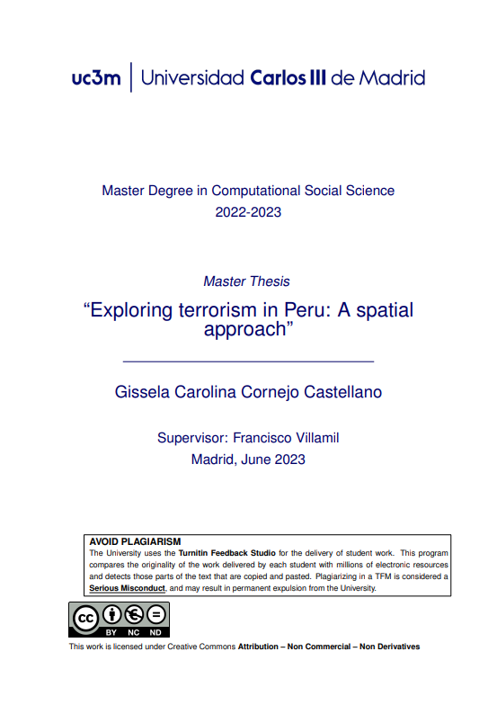
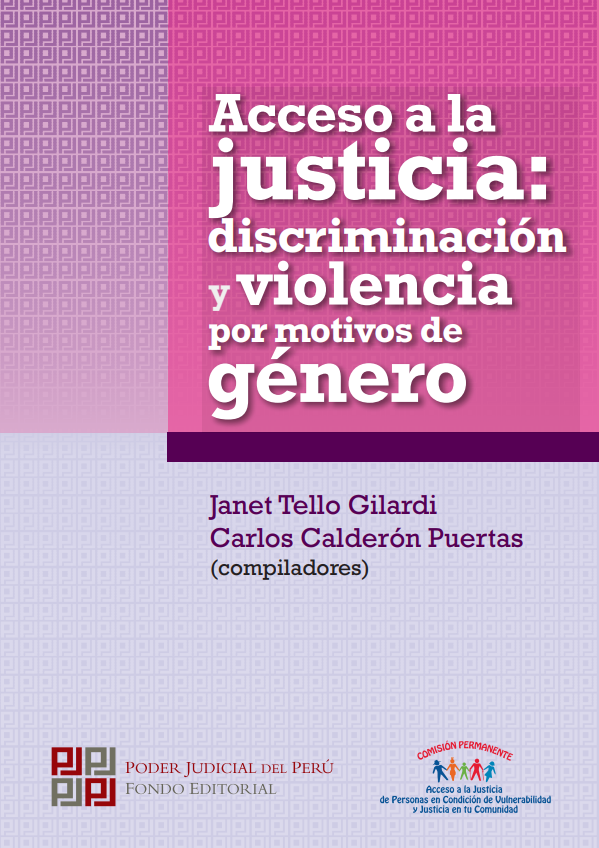
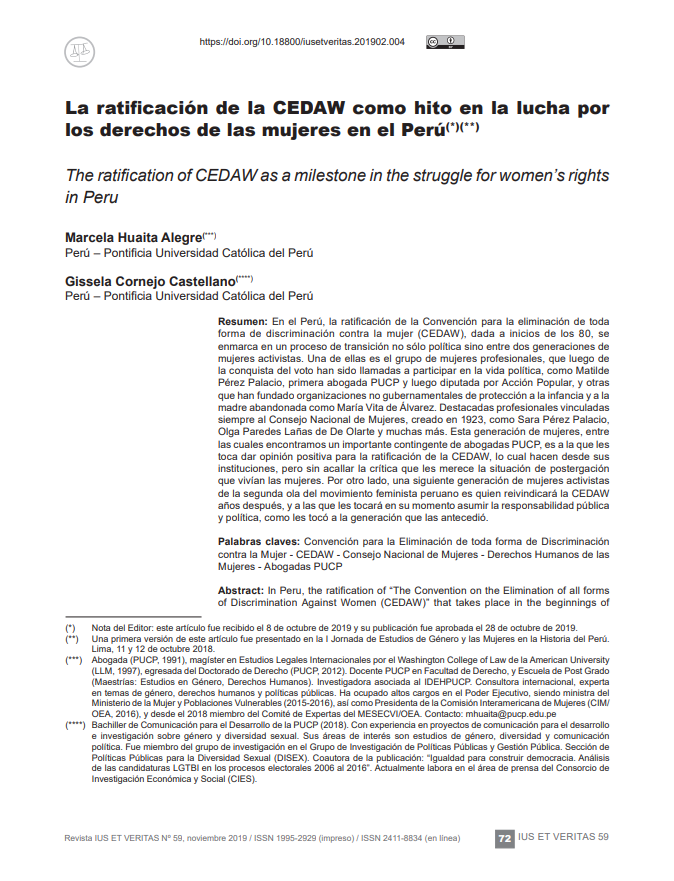
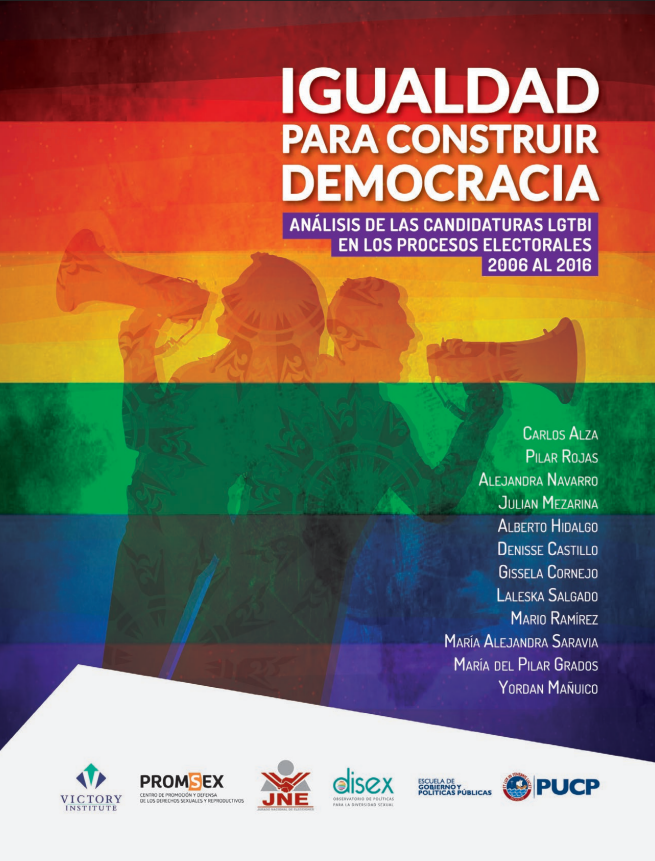

 

También puedes ver mi currículum más detallado en LinkedIn: [https://www.linkedin.com/in/cornejocastellano](https://www.linkedin.com/in/cornejocastellano)

## Experiencia

<table class="content-cv-table">
    <thead>
        <tr>
            <th>Organización</th>
            <th>Link</th>
            <th>Rol</th>
            <th>Fechas</th>
            <th>Lugar</th>
        </tr>
    </thead>
    <tbody>
        <tr>
            <td></td>
            <td><a href="https://www.vestas.com/en/" target="_blank">Vestas</a></td>
            <td>Construction Quality Deployment Lead</td>
            <td>2025 – Hoy</td>
            <td>Madrid, España</td>
        </tr>
        <tr>
            <td></td>
            <td><a href="https://worldvision.pe/" target="_blank">World Vision</a></td>
            <td>Analista Nacional de Manejo de la Información</td>
            <td>2024 – 2025</td>
            <td>Lima, Perú</td>
        </tr>
        <tr>
            <td></td>
            <td><a href="https://www.vestas.com/en/" target="_blank">Vestas</a></td>
            <td>Data Management Trainee</td>
            <td>2023</td>
            <td>Madrid, España</td>
        </tr>
        <tr>
            <td></td>
            <td><a href="https://www.cies.org.pe/" target="_blank">Consorcio de Investigación Económica y Social</a></td>
            <td>Gestora de Bases de Datos de Monitoreo y Evaluación</td>
            <td>2019 – 2021</td>
            <td>Lima, Perú</td>
        </tr>
        <tr>
            <td></td>
            <td><a href="https://www.pucp.edu.pe/" target="_blank">Pontificia Universidad Católica del Perú</a></td>
            <td>Asistente de Investigación</td>
            <td>2018 – 2021</td>
            <td>Lima, Perú</td>
        </tr>
            <tr>
            <td></td>
            <td><a href="https://www.alberodellavita.org/" target="_blank">Fondazione l'Albero della Vita</a></td>
            <td>Pasante</td>
            <td>2018</td>
            <td>Lima, Perú</td>
        </tr>
    </tbody>
</table>

---

## Educación

<table class="content-cv-table">
    <thead>
        <tr>
            <th>Institución</th>
            <th>Link</th>
            <th>Grado</th>
            <th>Fechas</th>
        </tr>
    </thead>
    <tbody>
        <tr>
            <td></td>
            <td><a href="https://www.uc3m.es/" target="_blank">Universidad Carlos III de Madrid</a></td>
            <td>Máster Universitario en Ciencias Sociales Computacionales</td>
            <td>2024</td>
        </tr>
        <tr>
            <td></td>
            <td><a href="https://www.pucp.edu.pe/" target="_blank">Pontificia Universidad Católica del Perú</a></td>
            <td>Diplomado en Ciencia de Datos para las Ciencias Sociales y la Gestión Pública</td>
            <td>2021-2022</td>
        </tr>
        <tr>
            <td></td>
            <td><a href="https://www.ue.edu.pe/" target="_blank">Universidad ESAN</a></td>
            <td>Diplomado en Monitoreo y Evaluación de Programas y Proyectos</td>
            <td>2024</td>
        </tr>
        <tr>
            <td></td>
            <td><a href="https://www.pucp.edu.pe/" target="_blank">Pontificia Universidad Católica del Perú</a></td>
            <td>Bachiller en Comunicación para el Desarrollo</td>
            <td>2021-2022</td>
        </tr>
    </tbody>
</table>

---

## Publicaciones

<table class="content-cv-table">
    <thead>
        <tr>
            <th>Portada</th>
            <th>Título</th>
            <th>Referencia</th>
            <th>Publisher</th>
        </tr>
    </thead>
    <tbody>
        <tr>
            <td></td>
            <td><a href="https://renati.sunedu.gob.pe/handle/sunedu/3627523" target="_blank">Exploring terrorism in Peru: a spatial approach</a></td>
            <td>Cornejo Castellano, C. (2023)</td>
            <td><a href="https://www.uc3m.es/" target="_blank">Universidad Carlos III de Madrid</a></td>
        </tr>
            <tr>
            <td></td>
            <td>
            <a href="https://cies.org.pe/publicaciones/guia-para-elaborar-investigaciones-periodisticas-sobre-trata-de/" target="_blank">Guía para elaborar investigaciones periodísticas sobre trata de personas (supervisión editorial)</a>
            </td>
            <td>
            Fernández, L. (2021)
            </td>
            <td><a href="https://www.cies.org.pe/" target="_blank">Consorcio de Investigación Económica y Social</a></td>
        </tr>
        <tr>
            <td></td>
            <td><a href="https://www.pj.gob.pe/wps/wcm/connect/f8e04a004cef7018bd0effe93f7fa794/ACCESO+A+LA+JUSTICIA+Y+G%C3%89NERO+WEB.pdf?MOD=AJPERES&CACHEID=f8e04a004cef7018bd0effe93f7fa794" target="_blank">Violencia de género ejercida en el ámbito familiar contra niños, niñas y adolescentes percibidos como parte de la población LGTBI</a></td>
            <td>Huaita Alegre, M., Chavez Granda, J.,Cornejo Castellano, G. & Saravia Pinazo, M. (2019)</td>
            <td><a href="https://www.pj.gob.pe/" target="_blank">Poder Judicial del Perú</a></td>
        </tr>
        <tr>
            <td></td>
            <td><a href="https://revistas.pucp.edu.pe/index.php/iusetveritas/article/view/22474" target="_blank">La ratificación de la CEDAW como hito en la lucha por los derechos de las mujeres en el Perú</a></td>
            <td>Huaita Alegre, M., & Cornejo Castellano, G.(2019).</td>
            <td><a href="https://www.pj.gob.pe/" target="_blank">Ius et Veritas</a></td>
        </tr>
        <tr>
            <td></td>
            <td><a href="https://promsex.org/publicaciones/igualdad-para-construir-democracia-analisis-de-candidaturas-lgtbi-en-los-procesos-electorales-de-2006-a-2016/" target="_blank">Igualdad para construir democracia. Análisis de candidaturas LGTBI en los procesos electorales de 2006 a 2016</a></td>
            <td>Alza, Carlos, et.al. (2017).</td>
            <td><a href="https://portal.jne.gob.pe/portal" target="_blank">Jurado Nacional de Elecciones y Observatorio de Políticas Públicas para la Diversidad Sexual (DISEX), PUCP</a></td>
        </tr>
    </tbody>
</table>

